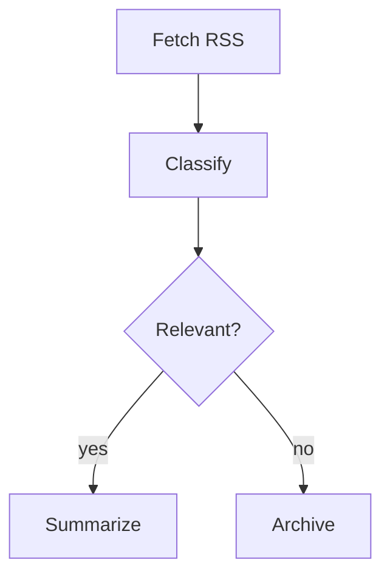

# psflow

A domain-agnostic graph execution engine using annotated Mermaid files as the single-file definition format. Topology, typing, node implementation, and execution semantics all live in one `.mmd` file.

Built for offline workflow orchestration, with architecture targeting real-time use, native embedding (C FFI / Unity), WASM for browser, and PyO3 for Python.

## Key Idea

Workflow pipelines, behavior trees, dataflow graphs, and reactive signal networks differ only in *how* they evaluate the graph, not in how the graph is represented. psflow provides a universal graph data model with swappable executor strategies.

## Annotated Mermaid

Workflows are standard `.mmd` files. The graph topology uses normal Mermaid flowchart syntax -- renderable with any Mermaid tool, previewable on GitHub, and natively understood by LLMs. Node configuration is embedded as structured `%%` comments:



The annotation convention is `%% @<NodeID> <key.path>: <value>`. Mermaid renderers ignore these comments, so the file stays valid and visual everywhere.

## Features

**Graph Engine**
- Typed port system (string, bool, i64, f32, Vec, Map, domain types)
- Nested/hierarchical subgraphs
- Cycle detection, validation, orphan detection

**Execution Strategies**
- Topological/batch -- dependency-ordered parallel waves via tokio
- Reactive/dataflow -- fire-on-input-ready, propagate downstream
- Stepped/tick -- one evaluation cycle per call (BT-style)
- Event-driven -- external events push into entry nodes

**Control Flow**
- Sequence, parallel, race, branch, loop, retry with backoff
- Concurrency limits (global, per-parallel, per-adapter)
- Cooperative cancellation and per-node timeouts
- LLM oracle nodes for intelligent branch/race/loop decisions

**AI Adapters**
- Claude Code CLI adapter with session strategies (`new`, `continue`, `named`, `pool`)
- Mock adapter (deterministic testing)
- Adapter capability validation at graph load time
- Conversation history with auto-accumulation and ancestor-scoped filtering

**Scripting (Rhai)**
- Sandboxed Rhai scripting engine with execution limits
- Inline or external `.rhai` scripts as node handlers
- Rich guard expressions (comparisons, logic, string methods)
- Blackboard and execution context access from scripts

**Checkpoint/Resume**
- Serialize full execution state to JSON (`ExecutionSnapshot`)
- Resume from checkpoint -- completed nodes skipped, interrupted nodes re-executed
- Blackboard, branch decisions, and node outputs preserved across snapshots

**Observability**
- Execution event bus (tokio::broadcast)
- Structured logging via `tracing` with configurable verbosity
- Execution trace with per-node timing, outputs, and retry history
- Live mid-execution trace with ancestor-scoped filtering

## Getting Started

```bash
# Build
cargo build

# Run a graph
cargo run -- examples/dungeon_generator.mmd

# Run with debug logging
cargo run -- -vv examples/dungeon_generator.mmd

# Validate without executing
cargo run -- --validate examples/dungeon_generator.mmd

# Run tests
cargo test
```

Or with [just](https://github.com/casey/just):

```bash
just build
just test
just run examples/dungeon_generator.mmd
```

## CLI

```
psflow [OPTIONS] <FILE>

Arguments:
  <FILE>  Path to an annotated Mermaid (.mmd) file

Options:
      --validate    Validate the graph without executing
      --json        Output execution trace as JSON
  -v, --verbose...  Log verbosity (-v info, -vv debug, -vvv trace)
  -h, --help        Print help
```

Logging can also be controlled via the `RUST_LOG` environment variable:

```bash
RUST_LOG=psflow=debug cargo run -- graph.mmd
```

## Built-in Handlers

| Handler | Description |
|---------|-------------|
| `passthrough` | Forward inputs unchanged |
| `transform` | Rename output keys via mapping |
| `delay` | Wait for configured duration |
| `log` | Log inputs via tracing, then pass through |
| `merge` | Combine inputs into single map |
| `split` | Split map into individual outputs |
| `gate` | Conditional pass-through via guard expression |
| `error_transform` | Reshape error types |
| `http` | HTTP/API calls with templates |
| `read_file` / `write_file` / `glob` | File I/O with path templating |
| `rhai` | Execute inline or external Rhai scripts |
| `llm_call` | LLM inference via AI adapter with conversation history |
| `accumulator` | Append results to running collection on blackboard |

## Architecture

```
.mmd file --> Mermaid Parser --> Graph (petgraph)
                                    |
                              Executor (strategy)
                             /    |    |    \
                        Topo  Reactive Stepped Event
                              |
                         Node Handlers
                        /    |    \
                   Built-in  Rhai  Custom
```

**Graph** -- Immutable topology: nodes, typed ports, directed edges, nested subgraphs. Backed by petgraph.

**Executor** -- Swappable strategy that walks the graph. Selected at runtime via trait objects.

**Context** -- Runtime state: blackboard (scoped shared state), typed tokens on edges, cancellation, concurrency limits.

**AI Adapter** -- How the graph accesses LLM intelligence. Nodes request capabilities through the adapter trait without knowing the backend.

## LLM Context Management

When multiple LLM nodes execute in sequence, each node automatically accumulates its prompt/response exchange into a `ConversationHistory` on the blackboard. Subsequent LLM nodes receive this history as context.

**Ancestor-scoped filtering** ensures parallel branches don't pollute each other's context. In a diamond graph `A → B, A → C`, node B only sees A's history -- not C's.

Configuration per node:

```
%% @B config.context_depth: 5
%% @B config.context_max_tokens: 50000
```

Session strategies for the Claude CLI adapter control when to reuse vs spawn sessions:

```
%% @A config.session: "new"
%% @B config.session: "continue"
%% @C config.session: "named:review"
```

## Checkpoint/Resume

Long-running workflows can be checkpointed and resumed:

```rust
// Take a snapshot mid-execution
let snapshot = ctx.snapshot();
snapshot.save(Path::new("checkpoint.json"))?;

// Later: resume from where we left off
let snapshot = ExecutionSnapshot::load(Path::new("checkpoint.json"))?;
let result = executor.resume(&graph, &handlers, snapshot).await?;
```

Completed nodes are skipped on resume. Interrupted nodes are re-executed. Blackboard state, branch decisions, and outputs are preserved.

## Documentation

| Document | Audience |
|---|---|
| [Host Integration Quickstart](docs/host-integration-quickstart.md) | Rust engineer embedding psflow for the first time — covers `SecretResolver`, auth wiring, and running a graph |
| [Mermaid Annotation Reference](docs/mermaid-annotation-reference.md) | Graph authors — full config key reference for `http`, `ws`, `poll_until`, and auth strategy declarations |

## License

Proprietary -- Polymetric Studios
