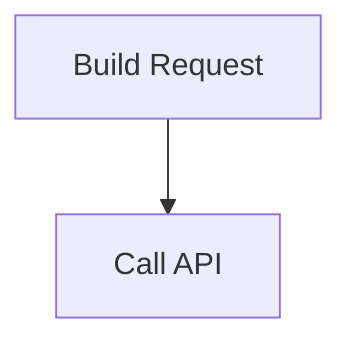

# Writing Flow `.mmd` Files

A how-to guide for authoring psflow flow graphs. A flow is a standard Mermaid
flowchart whose runtime semantics live in `%%` comment annotations — so the file
renders as a normal diagram everywhere, while psflow reads the annotations to
execute it.

This guide is task-oriented: structure first, then the traps that actually bite.
For the exhaustive per-handler config surface, see
[mermaid-annotation-reference.md](./mermaid-annotation-reference.md). For embedding
psflow in a host program, see [host-integration-quickstart.md](./host-integration-quickstart.md).

---

## 1. Anatomy of a flow file

Every flow has two layers in one file:

1. **Topology** — ordinary Mermaid (`graph TD`, nodes, edges). This is what
   renders.
2. **Annotations** — `%%` comment lines of the form `%% @<target> <key>: <value>`
   that bind handlers, ports, config, and auth to the topology.



The loader: parses the topology → applies annotations (handlers, ports, config) →
resolves each edge to a single port pair → validates. Lines that are not `%% @`
annotations or Mermaid topology are ignored, so you can write ordinary `%%`
comments freely.

---

## 2. Annotation grammar

```
%% @<target> <key>: <value>
```

- **`<target>`** is either the literal `graph` (graph-level declarations) or a
  node ID from the topology (`INPUT`, `EXECUTE`, …).
- **`<key>`** is a dot-separated path. Dots build nested JSON: `config.url` sets
  `node.config["url"]`; `config.retry.delay_ms` sets `node.config["retry"]["delay_ms"]`.
- **`<value>`** is parsed as JSON first; if that fails (no quotes, no brackets)
  the raw text becomes a string. So `bearer` and `"bearer"` both yield the string
  `bearer`; `5000` yields an integer; `true` a boolean; `["a","b"]` an array.

Recognised top-level key prefixes on a node: `handler`, `config.<path>`,
`exec.<path>`, `inputs.<port>`, `outputs.<port>`. Unknown keys fall back into
`node.config`.

---

## 3. Multiline values: `>>>` … `%% <<<`

Inline scripts and long templates use a block, opened with `>>>` as the value and
closed with a `%% <<<` line. Each `%%` line in between contributes one raw line
(the `%% ` prefix is stripped, remaining indentation preserved, lines joined with
`\n`).

```mermaid
    %% @PLAN config.prompt: >>>
    %%   Plan the feature: {inputs.description}
    %%
    %%   Consider architecture.
    %% <<<
```

> **Gotcha.** The block sigils are `>>>` / `<<<`. A YAML-style `|` does **not**
> work — it gets passed through as the literal value and your script fails to
> parse. Always close the block with `%% <<<` or you get an "unclosed block" error.

---

## 4. Ports and edges — the one-arrow-one-port rule

This is the single most common source of confusion.

**Each Mermaid arrow binds exactly ONE output port to ONE input port.** A node
that declares two required inputs cannot have both fed by a single arrow — only
one binds, and validation reports the other as `missing required input`.

Edge port resolution runs in this priority order (see `src/mermaid/loader.rs`):

1. Source has one output **and** target has one input → connect them.
2. A matching port **name** on both sides.
3. A type-**compatible** pair.
4. Single port on whichever side has exactly one.
5. Otherwise empty/untyped.

### Practical rules

- **Keep each node to a single wired input** wherever you can. This makes binding
  unambiguous (rule 1).
- **Hardcode constants** instead of threading them as extra inputs. Example: put a
  fixed URL path segment directly in `config.url` rather than passing it as a
  second input port just to interpolate it.
- **To feed multiple inputs**, give the target multiple incoming arrows whose
  source output names match the target input names (rule 2), or split the work
  across nodes.
- Declaring `outputs.<port>` / `inputs.<port>` with a type enables type-checked
  binding (rule 3) and is good practice for clarity.

### Conditional routing

Edge labels (`A -->|yes| B`) are preserved on the edge. The registered `gate`
handler blocks data flow when its guard is falsy (it emits empty outputs),
which prunes the downstream branch. Branch-decision handlers that route on a
label (e.g. an LLM `decision`) are **not** in the default registry — a host must
register them (see §7).

---

## 5. Graph-level declarations

Use `%% @graph <key>: <value>`.

| Key | Purpose |
|---|---|
| `name` | Graph display name |
| `description` | Human description |
| `version` | Version tag |
| `default_executor` | Executor hint (not enforced at load) |
| `required_adapter` | AI adapter requirement, checked at load |
| `author` | Author tag |

### Auth strategies

Declare a strategy once at graph scope, then nodes opt in with `config.auth`:

```mermaid
    %% @graph auth.api.type: bearer
    %% @graph auth.api.secrets.token: MY_API_TOKEN

    %% @Fetch config.auth: api
```

- `auth.<name>.type` — a built-in (`bearer`, `static_header`, `hmac`, `cookie_jar`)
  or a host-registered type.
- `auth.<name>.params.*` — strategy parameters.
- `auth.<name>.secrets.<role>: <LOGICAL_NAME>` — maps a role to a logical name the
  host's `SecretResolver` understands (e.g. an env var name). **The token value
  never appears in the file.**

> **`x-api-key`-style APIs:** use `bearer` with `params.header: x-api-key` and
> `params.scheme: ""` (empty scheme) to inject the raw token as
> `x-api-key: <token>`. See the Composio example in §9.

Full param tables for each strategy are in
[mermaid-annotation-reference.md §2](./mermaid-annotation-reference.md).

---

## 6. Handler catalog (default-registered)

These handlers are available out of the box (`NodeRegistry::with_defaults_full`).
The table below is generated from the handler manifest — regenerate it with
`cargo run --bin psflow-manifest --features runtime`. Config knobs and ports per
handler live in the reference doc; this is the purpose-level map.

| Handler | Purpose |
|---|---|
| `accumulator` | Append an input value to a running collection on the blackboard |
| `break` | Signal the loop controller to stop after the current iteration |
| `delay` | Wait a fixed duration, then forward inputs unchanged |
| `error_transform` | Reshape error-related outputs into data |
| `gate` | Forward inputs only when the guard is truthy; otherwise emit nothing (blocks the branch) |
| `glob` | List files matching a glob pattern |
| `http` | Make an HTTP request |
| `json_transform` | Extract or shape JSON using JMESPath |
| `log` | Log inputs at info level (prefixed by node label), then forward them unchanged |
| `merge` | Combine all inputs into a single map — fan-in |
| `passthrough` | Forward all inputs as outputs unchanged |
| `read_file` | Read a file's contents |
| `rhai` | Execute an inline or file-backed Rhai script (scope: inputs, config, ctx) |
| `select` | Extract a value from workflow state by dotted path, optionally projecting/joining arrays |
| `shell` | Execute an external shell command |
| `split` | Fan a map or array input out into separate outputs (map keys, or item_N for arrays) |
| `transform` | Rename output keys via a config mapping |
| `write_file` | Write content to a file |
| `ws` | Open a WebSocket connection, send init frames, and stream received frames until a termination trigger |

### Handlers that require host wiring

Some documented handlers are **not** registered by default because they need
host-supplied dependencies. Referencing them in a graph run by the stock CLI
produces an `unregistered handler` warning. They include:

- `llm_call` — needs an `AiAdapter` the host provides.
- `poll_until`, `subgraph_invoke` — need a graph library to resolve named subgraphs.
- branch-decision and other custom handlers — host-registered.

If your flow uses these, run it from a host that registers them (see
[host-integration-quickstart.md](./host-integration-quickstart.md)).

---

## 7. Handler-specific gotchas

- **rhai has no `parse_json`.** The script engine registers only a small custom
  surface (`ctx_get`, `ctx_has`) on top of stock Rhai — there is no in-script JSON
  parser. Do JSON shaping with the `json_transform` handler instead, or keep
  values as strings. Object maps use Rhai's `#{ key: value }` syntax; `\"` escapes
  work inside Rhai string literals.
- **`http` templating.** `{key}` interpolation pulls from the node's input map and
  is available in `url`, header values, `body`, `body_sink.file.path`,
  `validation.file`, and multipart file paths. Build a complex JSON body upstream
  and pass it as a single `{token}` rather than embedding many `{...}` fragments
  (literal braces in the body can be misread as interpolation tokens).
- **`http` localhost.** Requests to loopback/private IPs are blocked by default
  (SSRF guard). Add `config.allow_private: true` to hit `127.0.0.1` in tests.
- **`shell` secrets.** The `shell` handler resolves secrets through the host
  resolver, same as auth — don't bake credentials into `config.command`.

---

## 8. Validate, then run

### Validate (always do this first)

```bash
psflow --validate path/to/flow.mmd
```

Checks orphan nodes, port existence, type compatibility, missing required inputs,
and cycles. Common errors:

| Error | Meaning |
|---|---|
| `missing required input: N.p` | Input port `p` on node `N` has no incoming edge bound to it (usually the one-arrow-one-port trap, §4) |
| `unregistered handler 'X'` | `X` isn't in this runner's registry (§6) |
| `port not found` | An edge references a port name the node doesn't declare |
| `unclosed block` | A `>>>` block missing its `%% <<<` (§3) |

### Run

```bash
psflow path/to/flow.mmd          # execute, print node states
psflow --json path/to/flow.mmd   # machine-readable result
```

> **Auth'd flows need a host with a `SecretResolver`.** The stock `psflow` CLI
> uses `with_defaults` and installs no resolver, so a graph that references an
> auth strategy fails at execution. Run such flows from a host that wires
> `with_defaults_full` + a resolver (the `composio` bin in this repo is a minimal
> example), or via the embedding pattern in the quickstart.

---

## 9. Worked example

A flow that calls an authenticated API through the `http` handler with the key
injected from the environment — the pattern used by `examples/composio_tool_execute.mmd`:


What makes it work: `INPUT` and `EXECUTE` each have a single wired port (clean
binding); the body is built upstream and passed as one `{request_body}` token; the
key is referenced by logical name only and resolved by the host at run time.

---

## 10. Authoring checklist

- [ ] Every node has a `handler`.
- [ ] Each node's required inputs are each fed by their own incoming arrow.
- [ ] Constants are hardcoded, not threaded as extra input ports.
- [ ] Multiline scripts/templates use `>>>` … `%% <<<`.
- [ ] No `parse_json` (or other unregistered functions) in `rhai` scripts.
- [ ] Secrets are referenced by logical name in `auth.*.secrets.*`, never inlined.
- [ ] `psflow --validate` passes.
- [ ] If the flow uses auth or host-only handlers, you're running it from a host
      that wires a resolver / registers those handlers.
