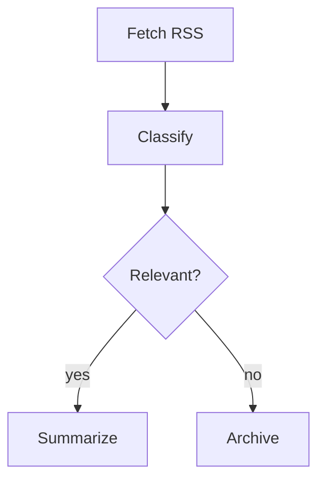

# Process Control Framework — Master Task List

**Rust · Mermaid-Extended · Offline-First · Multi-Target**

A domain-agnostic graph execution engine using annotated Mermaid files as the single-file definition format — topology, typing, node implementation, and execution semantics all in one `.mmd` file. Designed for offline workflow orchestration (Ergon primary), with architecture targeting real-time use, native embedding (C FFI / Unity), WASM for browser, and PyO3 for Python.

---

## Design Overview

### Core Concept

The framework is a single foundational library for process control that can drive any project needing graph-based execution — workflow orchestration, dataflow pipelines, behavior trees, or reactive signal networks. The same core engine handles all of these by treating them as different execution strategies over a common directed graph with typed ports.

The key architectural insight: BTs, DAG pipelines, and reactive dataflow graphs differ only in *how* they evaluate the graph, not in how the graph itself is represented. The graph data model is universal; the executor is a swappable strategy.

### Authoring Model: Annotated Mermaid

Workflows are defined as standard `.mmd` files. The graph topology uses normal Mermaid flowchart syntax — renderable with any Mermaid tool, previewable on GitHub, and natively understood by LLMs. Node configuration is embedded as structured `%%` comments using a `@NodeID property.path: value` convention. Mermaid renderers ignore these comments, so the file stays valid and visual everywhere.

One file, one format. The loader parses the Mermaid topology and extracts `@`-prefixed comments into a structured config object using dot-path expansion. The annotation convention is `%% @<NodeID> <key.path>: <value>` — flat enough to scan, structured enough for typed ports and nested config.

Control flow beyond what Mermaid natively expresses (parallel execution, loops, retries) is handled through subgraph labels or node name prefixes that the parser recognizes as execution directives, keeping the Mermaid valid and renderable.

### Execution Architecture

The engine separates three concerns cleanly:

**Graph** — The topology: nodes, typed ports, directed edges, nested subgraphs. Immutable once loaded. Knows nothing about how it will be executed. Backed by `petgraph` for efficient graph operations.

**Executor** — The strategy that walks the graph. Swappable per invocation via trait objects. Four strategies planned:
- *Topological/batch* — dependency-ordered, parallel waves via `tokio` tasks. Primary mode for Ergon.
- *Reactive/dataflow* — fire-on-input-ready, propagate downstream. For signal-flow and music tools.
- *Stepped/tick* — one full evaluation cycle per call. For BT-style and game-loop patterns.
- *Event-driven* — external events push into entry nodes. For webhook/trigger workflows.

**Context** — Runtime state: the blackboard (scoped shared state using arena allocation), immutable tokens flowing on edges, and execution snapshots for checkpoint/resume. Subgraphs inherit parent context with configurable isolation.

**AI Adapter** — The strategy for how the graph accesses LLM intelligence. Swappable per invocation via trait objects, independent of the executor. Nodes that need LLM capabilities (transform, classification, generation, judgment) request them through the adapter trait — they never know which backend is running. Four adapters planned:
- *Claude Code CLI* — subprocess with persistent conversation, built-in tool use, and context accumulation. Primary adapter for development and Ergon use.
- *Anthropic API* — direct HTTP via `reqwest`. Stateless request/response; context managed manually via blackboard. For production and fine-grained control.
- *OpenAI-compatible* — HTTP, same interface shape. For local models (ollama, llama.cpp) and cost optimization.
- *Mock* — in-memory, deterministic responses. For testing and CI.

The adapter declares its capabilities (tool use, structured output, vision, conversation history) and nodes assert what they require. Capability mismatches are caught at graph validation time, not runtime.

### LLM Integration Model

LLMs participate in the graph in two distinct roles:

**LLM as transform** — data flows in, the LLM processes it, structured data flows out. The LLM is the compute inside a standard node handler. Used for classification, extraction, generation, summarization. The node's annotation specifies a prompt template with variable interpolation from context; the adapter handles the actual call.

**LLM as oracle** — the LLM makes routing decisions that affect execution topology. Branch guards, race scoring, and loop termination conditions can delegate to the LLM instead of using deterministic expressions. The annotation convention uses `guard_llm`, `criterion_llm`, or `while_llm` keys to signal that the decision point calls the adapter. This keeps the graph structure declarative while allowing intelligent control flow.

**LLM context accumulation** — as data flows through the graph, LLM nodes may need context from earlier nodes. When using the Claude Code CLI adapter, this happens naturally via the persistent conversation. For stateless adapters, the blackboard supports a `ConversationHistory` type that accumulates formatted context windows, passed to subsequent LLM calls automatically. The accumulator node (3.3.4) supports this pattern directly.

### Node Lifecycle

Every node follows a strict state machine: `idle → pending → running → completed | failed | cancelled`. Transitions emit events to an execution bus, enabling logging, tracing, and visual debugging without coupling to the engine internals.

Nodes implement a standard async handler trait: `async fn execute(&self, inputs: Inputs, ctx: &mut Context, config: &Config) -> Result<Outputs, NodeError>`. This is the only contract a domain-specific node needs to satisfy — everything else (scheduling, retries, error routing, cancellation, state persistence) is handled by the framework. The context carries a `CancellationToken` that handlers should check at natural yield points; cancellation from race resolution, timeouts, or user abort propagates through this mechanism.

### Data Flow Model

Data moves through the graph in two complementary ways:

- **Edge tokens** — Immutable typed packets that flow along edges from output port to input port. Type-checked at connection time and at runtime via a port type system: built-in scalars (string, bool, i64, f32), collections (Vec, Map), and registered domain types with optional JSON Schema validation. This is the primary data pathway.
- **Blackboard** — Scoped mutable state for cross-cutting concerns (conversation history, accumulated results, shared config). Access is controlled: global, subgraph-local, or node-local scope with read/write permissions. Uses arena allocation for cache-friendly access patterns.

The separation keeps pure dataflow nodes simple and testable while still supporting the stateful patterns that LLM orchestration demands.

### Target Bindings

Rust is the canonical implementation — optimized for performance, safety, and portability from day one. The architecture targets multiple bindings:

- **CLI binary** — Primary entry point for Ergon and standalone use.
- **C FFI** — Shared library for C/C#/Unity consumers (Hot City and other native projects).
- **WASM** — Browser use via `wasm-bindgen`; enables web-based visual tooling and in-browser execution.
- **PyO3** — Python bindings for data science and scripting integration.

The integration test suite is defined as graph-plus-expected-output pairs, ensuring consistent behavior across all binding targets.

---

## Phase 1 — Core Graph Engine

### 1.1 Graph Data Model

| ID | | Task | Details / Acceptance Criteria | Pri |
|----|---|------|-------------------------------|-----|
| 1.1.1 | [x] | Define core graph types | Node, Edge, Port (input/output), Graph types with generics for payload types; leverage `petgraph` for underlying graph storage | P0 |
| 1.1.2 | [x] | Implement directed graph with typed ports | Nodes have named, typed input/output ports; edges connect output→input with type validation at connection time via trait bounds | P0 |
| 1.1.3 | [x] | Support nested/hierarchical subgraphs | A node can contain a child Graph; exposed ports on the parent map to internal ports | P1 |
| 1.1.4 | [x] | Graph validation | Detect cycles (for DAG mode), orphan nodes, type mismatches, missing required inputs | P0 |
| 1.1.5 | [x] | Serialization to/from JSON | Full round-trip via `serde`: graph topology, port types, node config, subgraph hierarchy | P0 |
| 1.1.6 | [x] | Port type system | Define the type system for port values. Built-in scalar types (string, bool, i64, f32), collection types (Vec, Map), and a dynamic `Value` enum for domain types (e.g., `Room`, `MidiTrack`). Domain types registered by name with optional JSON Schema for validation. Port connections type-checked: exact match, or coercible (e.g., i64→f32). `Vec<T>` on output fans out to `T` inputs when `exec.strategy: "fan_out"` | P0 |
| 1.1.7 | [x] | Error type hierarchy | Define `NodeError` enum: `Failed { source, message, recoverable }`, `Timeout { elapsed, limit }`, `Cancelled { reason }`, `TypeMismatch { expected, got }`, `AdapterError { adapter, source }`. Errors propagate along edges to downstream nodes (marking them `cancelled`) unless caught by error handling nodes (3.1.4). Executor receives errors via the event bus. Serde-serializable for snapshots | P0 |
| 1.1.8 | [x] | Graph-level metadata | Graph struct includes: name, version, description, required adapter (optional), default executor strategy, required adapter capabilities, author, tags. Parsed from `%% @graph` annotations at file level. Validated by CLI runner and dry-run mode | P1 |

### 1.2 Mermaid Integration Layer

| ID | | Task | Details / Acceptance Criteria | Pri |
|----|---|------|-------------------------------|-----|
| 1.2.1 | [x] | Mermaid flowchart parser | Parse standard Mermaid flowchart syntax into internal graph representation (nodes, edges, subgraphs, labels, edge labels); extract `%% @NodeID` annotations into structured config via dot-path expansion. Use `nom` or `pest` for parsing | P0 |
| 1.2.2 | [x] | Define annotation schema | Formal spec for the `%% @<NodeID> <key.path>: <value>` convention: supported value types, reserved keys (handler, inputs, outputs, config, exec), dot-path nesting rules. Include `exec.*` namespace for node-level directives: `exec.strategy` (fan_out, race), `exec.fan_key`, `exec.retry`, `exec.max_attempts`, `exec.backoff`, `exec.loop`, `exec.loop_over`. Include `*_llm` sub-schema for oracle keys: `guard_llm`, `criterion_llm`, `while_llm` with nested `adapter`, `prompt`, `output`, `fallback`/`fallback_field` properties. Define `score`/`quality_score` output port convention for deterministic race resolution | P0 |
| 1.2.3 | [x] | Annotated Mermaid loader | Parse `.mmd` file, combine topology and extracted annotations into a fully typed, executable Graph | P0 |
| 1.2.4 | [x] | Convention layer for control flow | Subgraph labels or node name prefixes that the parser recognizes as parallel, loop, retry, race directives | P1 |
| 1.2.5 | [x] | Graph → annotated Mermaid export | Serialize internal graph back to valid `.mmd` with `%%` annotations for visualization and round-tripping | P1 |

### 1.T Testing — Core Graph Engine

| ID | | Task | Details / Acceptance Criteria | Pri |
|----|---|------|-------------------------------|-----|
| 1.T.1 | [x] | Unit tests for graph construction | Add/remove nodes and edges, port type validation rejects mismatches, duplicate edge detection | P0 |
| 1.T.2 | [x] | Unit tests for graph validation | Cycle detection, orphan node detection, missing required inputs, type mismatch reporting | P0 |
| 1.T.3 | [x] | Serde round-trip tests | Serialize graph to JSON and back; assert structural equality including subgraphs and port types | P0 |
| 1.T.4 | [x] | Mermaid parser tests | Parse representative `.mmd` files covering all node shapes, edge styles, subgraphs, and edge labels; verify extracted topology matches expected graph | P0 |
| 1.T.5 | [x] | Annotation extraction tests | Verify dot-path expansion, value type coercion, reserved key handling, malformed annotation error reporting | P0 |
| 1.T.6 | [x] | Mermaid round-trip tests | Load `.mmd` → export back to `.mmd` → reload; assert graph equivalence | P1 |
| 1.T.7 | [ ] | Fuzz the Mermaid parser | `cargo-fuzz` or `proptest` on parser input; no panics, graceful error on malformed input | P1 |

### 1.3 Execution Engine

| ID | | Task | Details / Acceptance Criteria | Pri |
|----|---|------|-------------------------------|-----|
| 1.3.1 | [ ] | Node lifecycle state machine | States: idle, pending, running, completed, failed, cancelled. Transitions enforced via enum + type state, events emitted | P0 |
| 1.3.2 | [ ] | Topological/batch executor | Resolve dependency order, run nodes sequentially or in parallel waves via `tokio`. Primary mode for Ergon pipelines | P0 |
| 1.3.3 | [ ] | Reactive/dataflow executor | Node fires when all inputs satisfied; changes propagate downstream. For music tool / signal-flow use cases | P1 |
| 1.3.4 | [ ] | Stepped/tick executor | Advance entire graph one evaluation cycle. Maps to BT-style tick, game-loop patterns | P2 |
| 1.3.5 | [ ] | Event-driven entry points | External events can push data into designated entry nodes, triggering downstream execution via channels | P1 |
| 1.3.6 | [ ] | Executor strategy as swappable trait | Common `Executor` trait; graph doesn't know which strategy runs it; selected at runtime via trait objects or compile-time via generics | P0 |
| 1.3.7 | [ ] | Cancellation model | Cooperative cancellation via `tokio_util::CancellationToken` passed to every handler through context. Handlers check `ctx.cancelled()` at natural yield points. Cancellation sources: race node cancels siblings, retry timeout, global execution timeout, explicit user cancel. In-flight LLM adapter calls are cancelled via the adapter's own cancellation (drop the future / abort subprocess). Node transitions to `cancelled` state, emits cancellation event, downstream nodes transition to `cancelled` without executing | P0 |
| 1.3.8 | [ ] | Per-node and global timeouts | Per-node timeout via annotation `exec.timeout_ms`. Global execution timeout configurable at engine level. Timeout triggers cancellation of the timed-out node (and its subtree for subgraphs). Timeout errors are `NodeError::Timeout` and can be caught by error handling nodes | P1 |

### 1.T (continued) — Execution Engine Tests

| ID | | Task | Details / Acceptance Criteria | Pri |
|----|---|------|-------------------------------|-----|
| 1.T.8 | [ ] | Node lifecycle state machine tests | Verify all valid transitions succeed, invalid transitions return errors, events emitted on each transition | P0 |
| 1.T.9 | [ ] | Topological executor tests | Linear chain, diamond dependency, fan-out/fan-in; verify correct execution order and parallel wave grouping | P0 |
| 1.T.10 | [ ] | Executor trait conformance tests | Generic test harness that any `Executor` impl must pass: single node, linear chain, error propagation | P0 |
| 1.T.11 | [ ] | Reactive executor tests | Node fires when all inputs satisfied; changes propagate downstream; verify no re-execution of unchanged branches | P1 |
| 1.T.12 | [x] | Port type system tests | Exact type match connects, mismatch rejected. Coercion (i64→f32) accepted. Vec<T>→T fan-out validated. Domain type registration and JSON Schema validation. Unknown type name rejected at load time | P0 |
| 1.T.13 | [ ] | Error propagation tests | Node failure cascades cancellation to downstream nodes. Error caught by catch node stops propagation. Timeout error triggers. Cancellation token checked by mock handler. Multiple concurrent failures handled correctly | P0 |
| 1.T.14 | [ ] | Cancellation tests | Race cancels siblings mid-execution. Global timeout cancels all running nodes. User cancel propagates. In-flight adapter calls cancelled. Cancelled node emits event and transitions correctly | P0 |
| 1.T.15 | [ ] | Graph metadata tests | Parse `%% @graph` annotations. Validate required adapter present. Reject graph with missing required capabilities | P1 |

---

## Phase 2 — Control Flow & State

### 2.1 Control Flow Primitives

| ID | | Task | Details / Acceptance Criteria | Pri |
|----|---|------|-------------------------------|-----|
| 2.1.1 | [ ] | Sequence node | Run children in order; fail-fast or continue-on-error configurable | P0 |
| 2.1.2 | [ ] | Parallel node | Run children concurrently via `tokio::join!`; configurable: all-must-succeed, any-can-fail, n-of-m | P0 |
| 2.1.3 | [ ] | Race node | Run children concurrently via `tokio::select!`, resolve on first completion, cancel siblings | P1 |
| 2.1.4 | [ ] | Conditional / branch node | Guard expressions evaluated against context; supports if/else and switch-on-value | P0 |
| 2.1.5 | [ ] | Loop nodes | Repeat (fixed count), while (guard condition), map-over-collection (fan-out/fan-in) | P0 |
| 2.1.6 | [ ] | Retry with backoff | Configurable max attempts, backoff strategy (fixed, exponential), timeout per attempt | P1 |
| 2.1.7 | [ ] | Subgraph invocation node | Call a named graph as a function; input/output port mapping; supports recursion guard | P1 |
| 2.1.8 | [ ] | Concurrency limits / throttling | Configurable max concurrent nodes per executor (`max_parallelism`), per parallel node (`config.max_concurrent`), and per adapter (`config.rate_limit`). Uses `tokio::sync::Semaphore`. Fan-out over 100 items with `max_concurrent: 5` runs 5 at a time. Adapter rate limiting prevents API quota exhaustion | P1 |
| 2.1.9 | [ ] | LLM guard for branch nodes | `guard_llm` annotation key with sub-schema: `adapter` (name or "default"), `prompt` (template with `{ctx.*}` interpolation), `output` (bool or enum), `fallback` (deterministic expression) or `fallback_field` (sibling config key used as deterministic alternative). Branch delegates decision to AI adapter; falls back to deterministic guard if adapter unavailable or on error | P1 |
| 2.1.10 | [ ] | LLM criterion for race nodes | `criterion_llm` annotation key: race delegates candidate selection to AI adapter. Adapter receives all candidate outputs, returns index of winner. Supports scoring rubric in prompt | P1 |
| 2.1.11 | [ ] | LLM condition for loop termination | `while_llm` annotation key: loop continues/stops based on AI adapter judgment. Adapter receives accumulated state, returns bool. Supports "is this good enough?" pattern | P1 |

### 2.2 State & Data Management

| ID | | Task | Details / Acceptance Criteria | Pri |
|----|---|------|-------------------------------|-----|
| 2.2.1 | [ ] | Typed token flow on edges | Immutable data packets flow along edges; type-checked at connection time and at runtime via enum dispatch | P0 |
| 2.2.2 | [ ] | Blackboard / scoped context | Shared mutable state with scoping (global, subgraph-local, node-local); read/write access control. Arena-allocated for performance | P0 |
| 2.2.3 | [ ] | Context inheritance for subgraphs | Child graphs inherit parent context with configurable isolation (read-only parent, private child scope) | P1 |
| 2.2.4 | [ ] | Execution snapshots | Serialize full execution state (node states, blackboard, pending tokens) via `serde` for checkpoint/resume | P1 |
| 2.2.5 | [ ] | Snapshot resume | Deserialize snapshot and continue execution from checkpoint; critical for long-running LLM workflows | P1 |

### 2.T Testing — Control Flow & State

| ID | | Task | Details / Acceptance Criteria | Pri |
|----|---|------|-------------------------------|-----|
| 2.T.1 | [ ] | Control flow primitive tests | Each primitive (sequence, parallel, race, branch, loop, retry, fan-out/fan-in) tested in isolation with mock nodes; verify ordering, cancellation, fan-out collection distribution, and error semantics. Include concurrency limit tests: parallel with `max_concurrent` respects semaphore bound | P0 |
| 2.T.2 | [ ] | Property-based tests for control flow | `proptest` — randomly compose control flow trees, verify invariants: no double-execution, all nodes reach terminal state, cancellation propagates | P1 |
| 2.T.3 | [ ] | Token flow tests | Type-checked delivery, fan-out duplication, missing input detection, type mismatch at runtime | P0 |
| 2.T.4 | [ ] | Blackboard scoping tests | Global vs subgraph-local vs node-local isolation; read/write permissions enforced; parent context inheritance | P0 |
| 2.T.5 | [ ] | Snapshot round-trip tests | Serialize mid-execution state, resume from snapshot, verify execution completes with correct results. Include case: snapshot with in-flight LLM call (pending adapter response) resumes correctly | P1 |
| 2.T.6 | [ ] | LLM guard tests | Branch node with `guard_llm`: mock adapter returns true/false, verify correct path taken. Test fallback to deterministic guard when adapter unavailable | P1 |
| 2.T.7 | [ ] | LLM race criterion tests | Race node with `criterion_llm`: mock adapter selects candidate by index, verify correct winner propagated and siblings cancelled | P1 |
| 2.T.8 | [ ] | LLM loop termination tests | Loop with `while_llm`: mock adapter returns true N times then false, verify correct iteration count and accumulated state | P1 |

---

## Phase 3 — Node System & Extensibility

### 3.1 Node Registry & Handler System

| ID | | Task | Details / Acceptance Criteria | Pri |
|----|---|------|-------------------------------|-----|
| 3.1.1 | [ ] | Node type registry | Register handler implementations by type name; lookup at graph load time. Use `inventory` crate or explicit registration | P0 |
| 3.1.2 | [ ] | Handler trait | Standard async handler trait: `async fn execute(&self, inputs, ctx, config) -> Result<Outputs>`; with lifecycle hooks (init, cleanup) | P0 |
| 3.1.3 | [ ] | Built-in utility nodes | Passthrough, transform/map, delay, log, merge, split, gate (conditional pass), race_select (collect race candidates and pick winner via score or LLM criterion), reactive_entry (designated re-entry point for reactive executor), event_entry (entry point for event-driven triggers), snapshot (checkpoint execution state for resume) | P1 |
| 3.1.4 | [ ] | Error handling nodes | Catch node (wraps children, routes errors), fallback (try A else B), error transform | P1 |
| 3.1.5 | [ ] | Plugin/extension loading | Load node handlers from shared libraries (`.so`/`.dylib`) at runtime via `libloading`, or compile-time via feature flags | P2 |

### 3.2 AI Adapter System

| ID | | Task | Details / Acceptance Criteria | Pri |
|----|---|------|-------------------------------|-----|
| 3.2.1 | [ ] | AI adapter trait | `trait AiAdapter { async fn complete(&self, req: AiRequest) -> Result<AiResponse>; async fn judge(&self, candidates: &[&str], criteria: &str) -> Result<usize>; fn capabilities(&self) -> AdapterCapabilities; }` Core abstraction all backends implement | P0 |
| 3.2.2 | [ ] | Adapter capabilities & validation | `AdapterCapabilities` struct declaring: tool_use, structured_output, vision, conversation_history, max_tokens. Nodes declare required capabilities; graph validation rejects mismatches before execution | P0 |
| 3.2.3 | [ ] | AiRequest / AiResponse types | Request: prompt template, variables, output schema, temperature, max_tokens, stop sequences. Response: text, structured data, token usage, latency. Serde-serializable for snapshot/replay | P0 |
| 3.2.4 | [ ] | Claude Code CLI adapter | Subprocess lifecycle management: spawn session, send prompts via stdin, parse responses from stdout, maintain conversation context across calls, clean shutdown. Primary development adapter | P0 |
| 3.2.5 | [ ] | Anthropic API adapter | Direct HTTP via `reqwest` to Messages API. Stateless; context assembled from blackboard per-call. Supports tool_use and structured output via API features | P1 |
| 3.2.6 | [ ] | OpenAI-compatible adapter | HTTP to any OpenAI-shaped endpoint (ollama, vllm, litellm). Capability detection via model metadata. For local models and cost optimization | P1 |
| 3.2.7 | [ ] | Mock adapter | Deterministic responses from a response map (prompt pattern → canned response). For testing and CI | P0 |
| 3.2.11 | [ ] | Mock adapter recording mode | Run graph with real adapter, save all request/response pairs keyed by prompt hash. Replay in tests via mock adapter for deterministic CI without live LLM calls | P1 |
| 3.2.8 | [ ] | Adapter registry & selection | Register adapters by name; select per-graph or per-node via annotation (`%% @NODE config.adapter: "claude_cli"`). Default adapter configurable at engine level | P0 |
| 3.2.9 | [ ] | Conversation context accumulation | `ConversationHistory` blackboard type: formatted message list (role, content, tool_results). Automatically passed to stateless adapters. Claude CLI adapter uses native conversation instead | P1 |
| 3.2.10 | [ ] | Prompt template engine | Variable interpolation from context/inputs (`{ctx.key}`, `{inputs.data}`), conditional sections, iteration over collections. Compiled at graph load time for validation | P0 |

### 3.3 Ergon Integration Nodes

| ID | | Task | Details / Acceptance Criteria | Pri |
|----|---|------|-------------------------------|-----|
| 3.3.1 | [ ] | LLM call node | Delegates to AI adapter trait (3.2.1) via prompt template engine (3.2.10). Configurable model, prompt template with variable interpolation from context, structured output parsing via adapter's capabilities. Supports both transform (data in → data out) and oracle (judge/decide) modes | P0 |
| 3.3.2 | [ ] | HTTP / API call node | Method, URL template, headers, body template, response extraction via `reqwest` | P1 |
| 3.3.3 | [ ] | File I/O nodes | Read file, write file, glob/list, with path templating from context | P1 |
| 3.3.4 | [ ] | Accumulator / memory node | Append results to a running collection in context; supports `ConversationHistory` type for LLM context windows. Configurable scope (global, subgraph, node) | P1 |
| 3.3.5 | [ ] | Human-in-the-loop node | Pause execution, present data, wait for external input via channel, resume with response | P2 |

### 3.T Testing — Node System

| ID | | Task | Details / Acceptance Criteria | Pri |
|----|---|------|-------------------------------|-----|
| 3.T.1 | [ ] | Registry lookup tests | Register, lookup, override, missing handler error; verify `inventory`-based or explicit registration works end-to-end | P0 |
| 3.T.2 | [ ] | Handler contract tests | Generic test harness any handler must pass: receives correct inputs, context mutations visible, config applied, cleanup called on failure | P0 |
| 3.T.3 | [ ] | Built-in node tests | Each utility node (passthrough, transform, delay, merge, split, gate) tested with representative inputs | P1 |
| 3.T.4 | [ ] | Error handling node tests | Catch routes errors correctly, fallback triggers on failure, error transform reshapes error types | P1 |
| 3.T.5 | [ ] | Integration node tests | LLM call node with mock adapter, file I/O nodes against temp directories, accumulator state persistence | P1 |
| 3.T.6 | [ ] | AI adapter trait tests | Generic test harness any adapter must pass: complete returns valid response, judge returns valid index, capabilities are accurate | P0 |
| 3.T.7 | [ ] | Mock adapter recording tests | Run graph with real adapter in recording mode, save responses, replay with mock adapter, verify identical graph outputs | P1 |
| 3.T.8 | [ ] | Claude Code CLI adapter tests | Subprocess lifecycle: spawn, send prompt, receive response, maintain conversation, clean shutdown. Test timeout handling and crash recovery | P1 |
| 3.T.9 | [ ] | Capability validation tests | Graph with nodes requiring structured_output; adapter without it → validation error at load time, not runtime | P0 |
| 3.T.10 | [ ] | Conversation context accumulation tests | Multiple LLM nodes in sequence; verify ConversationHistory builds correctly on blackboard; stateless adapter receives full context on each call. Include case: ConversationHistory exceeds token budget — verify truncation/windowing strategy applies | P1 |
| 3.T.11 | [ ] | Prompt template tests | Variable interpolation, missing variable errors, conditional sections, collection iteration, compile-time validation | P0 |

---

## Phase 4 — Observability & Tooling

### 4.1 Runtime Observability

| ID | | Task | Details / Acceptance Criteria | Pri |
|----|---|------|-------------------------------|-----|
| 4.1.1 | [ ] | Execution event bus | Emit structured events for: node state changes, data flow, errors, timing. Subscribe/unsubscribe via `tokio::broadcast` | P0 |
| 4.1.2 | [ ] | Structured logging | Per-node log context (node ID, execution ID, timestamp) via `tracing` crate; configurable verbosity with span hierarchies | P1 |
| 4.1.3 | [ ] | Execution trace / history | Record full execution trace (which nodes ran, in what order, with what data) for replay and debugging | P1 |
| 4.1.4 | [ ] | Performance metrics | Per-node timing, total execution time, bottleneck identification | P2 |

### 4.2 Developer Tooling

| ID | | Task | Details / Acceptance Criteria | Pri |
|----|---|------|-------------------------------|-----|
| 4.2.1 | [ ] | CLI runner | Load graph from annotated `.mmd` file, execute, output results via `clap`. Ergon's primary entry point | P0 |
| 4.2.2 | [ ] | Dry-run / validation mode | Parse and validate graph without executing; report type errors, missing handlers, unreachable nodes | P1 |
| 4.2.3 | [ ] | Mermaid live preview | Watch mode: edit Mermaid file, auto-render updated diagram. Integrates with existing Mermaid tooling | P2 |
| 4.2.4 | [ ] | Visual debugger | Step through execution node-by-node; inspect context/blackboard at each step. Web-based UI via WASM | P2 |

### 4.T Testing — Observability & Tooling

| ID | | Task | Details / Acceptance Criteria | Pri |
|----|---|------|-------------------------------|-----|
| 4.T.1 | [ ] | Event bus tests | Subscribe, receive expected events for node state changes, unsubscribe stops delivery, no event loss under concurrent execution | P0 |
| 4.T.2 | [ ] | CLI integration tests | Load `.mmd` file via CLI, execute, verify stdout/exit code; test validation mode, error reporting | P1 |
| 4.T.3 | [ ] | Execution trace tests | Run known graph, verify trace records correct node order, timing, and data snapshots | P1 |

---

## Phase 5 — Bindings & Distribution

### 5.1 Multi-Target Bindings

| ID | | Task | Details / Acceptance Criteria | Pri |
|----|---|------|-------------------------------|-----|
| 5.1.1 | [ ] | Document core API surface | Freeze and document the public API that must be preserved across all binding targets | P1 |
| 5.1.2 | [ ] | WASM compilation target | Compile core to WASM via `wasm-bindgen`; JS/TS bindings for browser-based tooling and web execution | P1 |
| 5.1.3 | [ ] | C FFI for Unity integration | Expose core engine as C-compatible shared library for Hot City and other native consumers via `cbindgen` | P1 |
| 5.1.4 | [ ] | PyO3 Python bindings | Python module wrapping core engine for data science and scripting integration | P2 |
| 5.1.5 | [ ] | Portable integration test suite | Graph + expected output pairs in JSON; runner harness that loads test definitions and executes against native Rust. Defines the canonical expected-output baseline all bindings must match | P1 |
| 5.1.6 | [ ] | Cross-binding conformance CI | CI pipeline that runs the test suite (5.1.5) through each binding target (C FFI, WASM JS, Python) and diffs results against the native Rust baseline. Failures block release | P1 |
| 5.1.7 | [ ] | Cross-compilation CI | Build and test matrix for native targets (macOS, Linux, Windows), WASM, and Python wheels | P2 |

---

## Dependency Map

**Critical path:** 1.1 → 1.2 → 1.3 → 2.1 → 2.2 → 3.1 → 3.3 → 4.1 → 4.2

**Parallel track:** 3.1.2 (handler trait) → 3.2.1 (adapter trait) → 3.2.4 (CLI adapter) + 3.2.7 (mock adapter) → 3.3.1 (LLM call node)

Phase 5 runs in parallel once Phases 1–2 are stable. AI adapters (3.2) can begin as soon as the handler trait (3.1.2) is defined — the adapter trait is independent of graph topology. The adapter parallel track runs alongside the rest of 3.1; it does not block on 3.1 completing. Claude Code CLI adapter (3.2.4) and mock adapter (3.2.7) should land first to unblock Ergon integration (3.3) and testing respectively. LLM oracle tasks (2.1.9–2.1.11) depend on both the adapter trait (3.2.1) and the control flow primitives (2.1.4–2.1.6). Port type system (1.1.6) and error hierarchy (1.1.7) are foundational — all subsequent phases assume them.

## Priority Key

| Priority | Meaning |
|----------|---------|
| **P0** | Must-have for MVP. Required for Ergon to function on the framework. |
| **P1** | Important for production use. Needed before the framework is truly general-purpose. |
| **P2** | Future / nice-to-have. Visual tooling, Python bindings, cross-compilation. |
