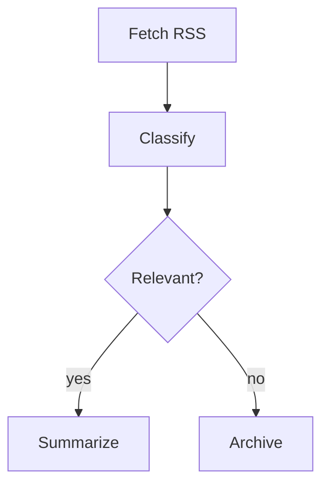

# Process Control Framework — Master Task List

**Rust · Mermaid-Extended · Offline-First · Multi-Target**

A domain-agnostic graph execution engine using annotated Mermaid files as the single-file definition format — topology, typing, node implementation, and execution semantics all in one `.mmd` file. Designed for offline workflow orchestration (Ergon primary), with architecture targeting real-time use, native embedding (C FFI / Unity), WASM for browser, and PyO3 for Python.

---

## Design Overview

### Core Concept

The framework is a single foundational library for process control that can drive any project needing graph-based execution — workflow orchestration, dataflow pipelines, behavior trees, or reactive signal networks. The same core engine handles all of these by treating them as different execution strategies over a common directed graph with typed ports.

The key architectural insight: BTs, DAG pipelines, and reactive dataflow graphs differ only in *how* they evaluate the graph, not in how the graph itself is represented. The graph data model is universal; the executor is a swappable strategy.

### Authoring Model: Annotated Mermaid

Workflows are defined as standard `.mmd` files. The graph topology uses normal Mermaid flowchart syntax — renderable with any Mermaid tool, previewable on GitHub, and natively understood by LLMs. Node configuration is embedded as structured `%%` comments using a `@NodeID property.path: value` convention. Mermaid renderers ignore these comments, so the file stays valid and visual everywhere.

One file, one format. The loader parses the Mermaid topology and extracts `@`-prefixed comments into a structured config object using dot-path expansion. The annotation convention is `%% @<NodeID> <key.path>: <value>` — flat enough to scan, structured enough for typed ports and nested config.

Control flow beyond what Mermaid natively expresses (parallel execution, loops, retries) is handled through subgraph labels or node name prefixes that the parser recognizes as execution directives, keeping the Mermaid valid and renderable.

### Execution Architecture

The engine separates three concerns cleanly:

**Graph** — The topology: nodes, typed ports, directed edges, nested subgraphs. Immutable once loaded. Knows nothing about how it will be executed. Backed by `petgraph` for efficient graph operations.

**Executor** — The strategy that walks the graph. Swappable per invocation via trait objects. Four strategies planned:
- *Topological/batch* — dependency-ordered, parallel waves via `tokio` tasks. Primary mode for Ergon.
- *Reactive/dataflow* — fire-on-input-ready, propagate downstream. For signal-flow and music tools.
- *Stepped/tick* — one full evaluation cycle per call. For BT-style and game-loop patterns.
- *Event-driven* — external events push into entry nodes. For webhook/trigger workflows.

**Context** — Runtime state: the blackboard (scoped shared state using arena allocation), immutable tokens flowing on edges, and execution snapshots for checkpoint/resume. Subgraphs inherit parent context with configurable isolation.

### Node Lifecycle

Every node follows a strict state machine: `idle → pending → running → completed | failed | cancelled`. Transitions emit events to an execution bus, enabling logging, tracing, and visual debugging without coupling to the engine internals.

Nodes implement a standard async handler trait: `async fn execute(&self, inputs: Inputs, ctx: &mut Context, config: &Config) -> Result<Outputs>`. This is the only contract a domain-specific node needs to satisfy — everything else (scheduling, retries, error routing, state persistence) is handled by the framework.

### Data Flow Model

Data moves through the graph in two complementary ways:

- **Edge tokens** — Immutable typed packets that flow along edges from output port to input port. Type-checked at connection time and at runtime via trait bounds and enum dispatch. This is the primary data pathway.
- **Blackboard** — Scoped mutable state for cross-cutting concerns (conversation history, accumulated results, shared config). Access is controlled: global, subgraph-local, or node-local scope with read/write permissions. Uses arena allocation for cache-friendly access patterns.

The separation keeps pure dataflow nodes simple and testable while still supporting the stateful patterns that LLM orchestration demands.

### Target Bindings

Rust is the canonical implementation — optimized for performance, safety, and portability from day one. The architecture targets multiple bindings:

- **CLI binary** — Primary entry point for Ergon and standalone use.
- **C FFI** — Shared library for C/C#/Unity consumers (Hot City and other native projects).
- **WASM** — Browser use via `wasm-bindgen`; enables web-based visual tooling and in-browser execution.
- **PyO3** — Python bindings for data science and scripting integration.

The integration test suite is defined as graph-plus-expected-output pairs, ensuring consistent behavior across all binding targets.

---

## Phase 1 — Core Graph Engine

### 1.1 Graph Data Model

| ID | | Task | Details / Acceptance Criteria | Pri |
|----|---|------|-------------------------------|-----|
| 1.1.1 | [ ] | Define core graph types | Node, Edge, Port (input/output), Graph types with generics for payload types; leverage `petgraph` for underlying graph storage | P0 |
| 1.1.2 | [ ] | Implement directed graph with typed ports | Nodes have named, typed input/output ports; edges connect output→input with type validation at connection time via trait bounds | P0 |
| 1.1.3 | [ ] | Support nested/hierarchical subgraphs | A node can contain a child Graph; exposed ports on the parent map to internal ports | P1 |
| 1.1.4 | [ ] | Graph validation | Detect cycles (for DAG mode), orphan nodes, type mismatches, missing required inputs | P0 |
| 1.1.5 | [ ] | Serialization to/from JSON | Full round-trip via `serde`: graph topology, port types, node config, subgraph hierarchy | P0 |

### 1.2 Mermaid Integration Layer

| ID | | Task | Details / Acceptance Criteria | Pri |
|----|---|------|-------------------------------|-----|
| 1.2.1 | [ ] | Mermaid flowchart parser | Parse standard Mermaid flowchart syntax into internal graph representation (nodes, edges, subgraphs, labels, edge labels); extract `%% @NodeID` annotations into structured config via dot-path expansion. Use `nom` or `pest` for parsing | P0 |
| 1.2.2 | [ ] | Define annotation schema | Formal spec for the `%% @<NodeID> <key.path>: <value>` convention: supported value types, reserved keys (handler, inputs, outputs, config, exec), dot-path nesting rules | P0 |
| 1.2.3 | [ ] | Annotated Mermaid loader | Parse `.mmd` file, combine topology and extracted annotations into a fully typed, executable Graph | P0 |
| 1.2.4 | [ ] | Convention layer for control flow | Subgraph labels or node name prefixes that the parser recognizes as parallel, loop, retry, race directives | P1 |
| 1.2.5 | [ ] | Graph → annotated Mermaid export | Serialize internal graph back to valid `.mmd` with `%%` annotations for visualization and round-tripping | P1 |

### 1.3 Execution Engine

| ID | | Task | Details / Acceptance Criteria | Pri |
|----|---|------|-------------------------------|-----|
| 1.3.1 | [ ] | Node lifecycle state machine | States: idle, pending, running, completed, failed, cancelled. Transitions enforced via enum + type state, events emitted | P0 |
| 1.3.2 | [ ] | Topological/batch executor | Resolve dependency order, run nodes sequentially or in parallel waves via `tokio`. Primary mode for Ergon pipelines | P0 |
| 1.3.3 | [ ] | Reactive/dataflow executor | Node fires when all inputs satisfied; changes propagate downstream. For music tool / signal-flow use cases | P1 |
| 1.3.4 | [ ] | Stepped/tick executor | Advance entire graph one evaluation cycle. Maps to BT-style tick, game-loop patterns | P2 |
| 1.3.5 | [ ] | Event-driven entry points | External events can push data into designated entry nodes, triggering downstream execution via channels | P1 |
| 1.3.6 | [ ] | Executor strategy as swappable trait | Common `Executor` trait; graph doesn't know which strategy runs it; selected at runtime via trait objects or compile-time via generics | P0 |

---

## Phase 2 — Control Flow & State

### 2.1 Control Flow Primitives

| ID | | Task | Details / Acceptance Criteria | Pri |
|----|---|------|-------------------------------|-----|
| 2.1.1 | [ ] | Sequence node | Run children in order; fail-fast or continue-on-error configurable | P0 |
| 2.1.2 | [ ] | Parallel node | Run children concurrently via `tokio::join!`; configurable: all-must-succeed, any-can-fail, n-of-m | P0 |
| 2.1.3 | [ ] | Race node | Run children concurrently via `tokio::select!`, resolve on first completion, cancel siblings | P1 |
| 2.1.4 | [ ] | Conditional / branch node | Guard expressions evaluated against context; supports if/else and switch-on-value | P0 |
| 2.1.5 | [ ] | Loop nodes | Repeat (fixed count), while (guard condition), map-over-collection (fan-out/fan-in) | P0 |
| 2.1.6 | [ ] | Retry with backoff | Configurable max attempts, backoff strategy (fixed, exponential), timeout per attempt | P1 |
| 2.1.7 | [ ] | Subgraph invocation node | Call a named graph as a function; input/output port mapping; supports recursion guard | P1 |

### 2.2 State & Data Management

| ID | | Task | Details / Acceptance Criteria | Pri |
|----|---|------|-------------------------------|-----|
| 2.2.1 | [ ] | Typed token flow on edges | Immutable data packets flow along edges; type-checked at connection time and at runtime via enum dispatch | P0 |
| 2.2.2 | [ ] | Blackboard / scoped context | Shared mutable state with scoping (global, subgraph-local, node-local); read/write access control. Arena-allocated for performance | P0 |
| 2.2.3 | [ ] | Context inheritance for subgraphs | Child graphs inherit parent context with configurable isolation (read-only parent, private child scope) | P1 |
| 2.2.4 | [ ] | Execution snapshots | Serialize full execution state (node states, blackboard, pending tokens) via `serde` for checkpoint/resume | P1 |
| 2.2.5 | [ ] | Snapshot resume | Deserialize snapshot and continue execution from checkpoint; critical for long-running LLM workflows | P1 |

---

## Phase 3 — Node System & Extensibility

### 3.1 Node Registry & Handler System

| ID | | Task | Details / Acceptance Criteria | Pri |
|----|---|------|-------------------------------|-----|
| 3.1.1 | [ ] | Node type registry | Register handler implementations by type name; lookup at graph load time. Use `inventory` crate or explicit registration | P0 |
| 3.1.2 | [ ] | Handler trait | Standard async handler trait: `async fn execute(&self, inputs, ctx, config) -> Result<Outputs>`; with lifecycle hooks (init, cleanup) | P0 |
| 3.1.3 | [ ] | Built-in utility nodes | Passthrough, transform/map, delay, log, merge, split, gate (conditional pass) | P1 |
| 3.1.4 | [ ] | Error handling nodes | Catch node (wraps children, routes errors), fallback (try A else B), error transform | P1 |
| 3.1.5 | [ ] | Plugin/extension loading | Load node handlers from shared libraries (`.so`/`.dylib`) at runtime via `libloading`, or compile-time via feature flags | P2 |

### 3.2 Ergon Integration Nodes

| ID | | Task | Details / Acceptance Criteria | Pri |
|----|---|------|-------------------------------|-----|
| 3.2.1 | [ ] | LLM call node | Configurable model, prompt template with variable interpolation from context, structured output parsing | P0 |
| 3.2.2 | [ ] | HTTP / API call node | Method, URL template, headers, body template, response extraction via `reqwest` | P1 |
| 3.2.3 | [ ] | File I/O nodes | Read file, write file, glob/list, with path templating from context | P1 |
| 3.2.4 | [ ] | Accumulator / memory node | Append results to a running collection in context; supports conversation history pattern | P1 |
| 3.2.5 | [ ] | Human-in-the-loop node | Pause execution, present data, wait for external input via channel, resume with response | P2 |

---

## Phase 4 — Observability & Tooling

### 4.1 Runtime Observability

| ID | | Task | Details / Acceptance Criteria | Pri |
|----|---|------|-------------------------------|-----|
| 4.1.1 | [ ] | Execution event bus | Emit structured events for: node state changes, data flow, errors, timing. Subscribe/unsubscribe via `tokio::broadcast` | P0 |
| 4.1.2 | [ ] | Structured logging | Per-node log context (node ID, execution ID, timestamp) via `tracing` crate; configurable verbosity with span hierarchies | P1 |
| 4.1.3 | [ ] | Execution trace / history | Record full execution trace (which nodes ran, in what order, with what data) for replay and debugging | P1 |
| 4.1.4 | [ ] | Performance metrics | Per-node timing, total execution time, bottleneck identification | P2 |

### 4.2 Developer Tooling

| ID | | Task | Details / Acceptance Criteria | Pri |
|----|---|------|-------------------------------|-----|
| 4.2.1 | [ ] | CLI runner | Load graph from annotated `.mmd` file, execute, output results via `clap`. Ergon's primary entry point | P0 |
| 4.2.2 | [ ] | Dry-run / validation mode | Parse and validate graph without executing; report type errors, missing handlers, unreachable nodes | P1 |
| 4.2.3 | [ ] | Mermaid live preview | Watch mode: edit Mermaid file, auto-render updated diagram. Integrates with existing Mermaid tooling | P2 |
| 4.2.4 | [ ] | Visual debugger | Step through execution node-by-node; inspect context/blackboard at each step. Web-based UI via WASM | P2 |

---

## Phase 5 — Bindings & Distribution

### 5.1 Multi-Target Bindings

| ID | | Task | Details / Acceptance Criteria | Pri |
|----|---|------|-------------------------------|-----|
| 5.1.1 | [ ] | Document core API surface | Freeze and document the public API that must be preserved across all binding targets | P1 |
| 5.1.2 | [ ] | WASM compilation target | Compile core to WASM via `wasm-bindgen`; JS/TS bindings for browser-based tooling and web execution | P1 |
| 5.1.3 | [ ] | C FFI for Unity integration | Expose core engine as C-compatible shared library for Hot City and other native consumers via `cbindgen` | P1 |
| 5.1.4 | [ ] | PyO3 Python bindings | Python module wrapping core engine for data science and scripting integration | P2 |
| 5.1.5 | [ ] | Integration test suite | Comprehensive tests defined as graph + expected output pairs; portable across all binding targets | P1 |
| 5.1.6 | [ ] | Cross-compilation CI | Build and test matrix for native targets (macOS, Linux, Windows), WASM, and Python wheels | P2 |

---

## Dependency Map

**Critical path:** 1.1 → 1.2 → 1.3 → 2.1 → 2.2 → 3.1 → 3.2 → 4.1 → 4.2

Phase 5 runs in parallel once Phases 1–2 are stable. Ergon integration (3.2) can begin as soon as the core engine and control flow primitives are functional.

## Priority Key

| Priority | Meaning |
|----------|---------|
| **P0** | Must-have for MVP. Required for Ergon to function on the framework. |
| **P1** | Important for production use. Needed before the framework is truly general-purpose. |
| **P2** | Future / nice-to-have. Visual tooling, Python bindings, cross-compilation. |
