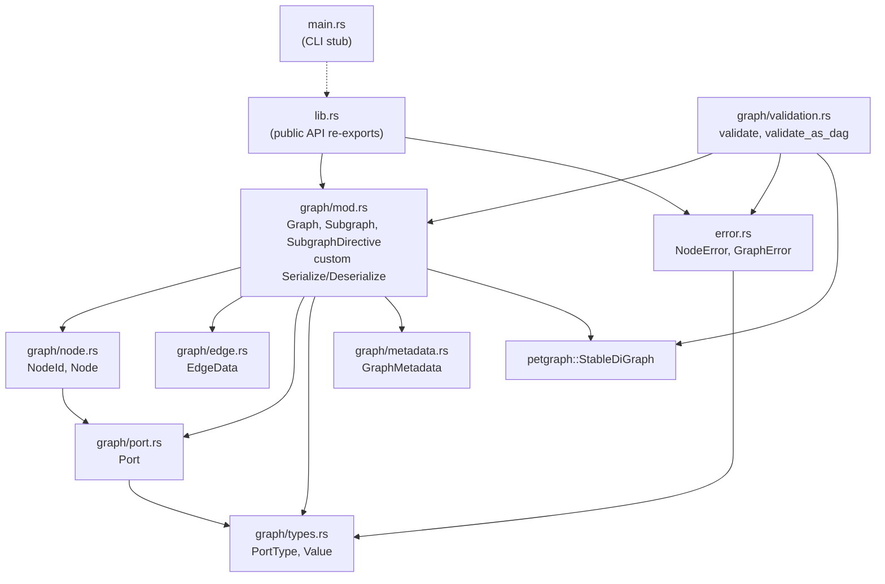

# Architecture

<!-- High-level mermaid diagram of module relationships and data flow. -->
<!-- Keep this diagram accurate as the codebase evolves. -->
<!-- Last updated: 2026-03-28 -->

## Module Relationships

## Key Design Decisions

1. **petgraph::StableDiGraph as backing store** -- Stable indices survive node/edge removal, which matters for incremental graph editing. Nodes carry `Node` weights; edges carry `EdgeData` weights.

2. **NodeId-to-NodeIndex map** -- `HashMap<NodeId, NodeIndex>` provides O(1) lookup by string ID while petgraph operates on integer indices internally.

3. **Custom serde** -- `Graph` implements `Serialize`/`Deserialize` manually to flatten the internal petgraph representation into a portable `{metadata, nodes[], edges[], subgraphs[]}` JSON format. Deserialization rebuilds the petgraph and node map.

4. **Validation collects all errors** -- `validate()` and `validate_as_dag()` return `Vec<GraphError>` rather than short-circuiting, so callers see every problem in one pass.

5. **Type compatibility is structural** -- `PortType::is_compatible_with` checks exact match, Any wildcard, i64-to-f32 coercion, and recursive Vec/Map element compatibility. Domain types match by name only.